# 개발 워크스테이션 구축

## 1. 프로젝트 개요

이 저장소는 코디세이 미션 1 「내 컴퓨터에 개발자용 작업실 꾸미기」의 수행 결과를 정리한 저장소입니다.

macOS 환경에서 터미널, Git, GitHub, OrbStack, Docker, Nginx를 직접 사용했습니다. 터미널 기본 명령, 파일·디렉터리 권한 변경, Docker 컨테이너 실행과 관리, Dockerfile 기반 웹 서버 제작, 포트 매핑, 바인드 마운트, Docker 볼륨 영속성, GitHub 및 VSCode 연동을 실습했습니다.

이번 문서는 단순히 실행 결과만 나열하지 않고, 평가자가 확인할 수 있도록 **명령어 → 실행 의미 → 검증 방법 → 증거 스크린샷 → 문제 해결** 순서로 정리했습니다.

---

## 2. 실행 환경

| 항목 | 내용 |
|---|---|
| OS | macOS 15.7.4 |
| Build | 24G517 |
| Shell | zsh (`/bin/zsh`) |
| Git | 2.53.0 |
| Docker | 28.5.2 |
| Docker 실행 환경 | OrbStack |
| Git 기본 브랜치 | `main` |
| 저장소 | `beatles12/codyssey` |

### 2-1. 실행 환경 확인 명령

```bash
sw_vers
echo $SHELL
git --version
docker --version
docker info
```

검증 기준:

- `git --version`으로 Git 설치 여부 확인
- `docker --version`으로 Docker 명령어 사용 가능 여부 확인
- `docker info`로 OrbStack 기반 Docker 엔진이 실제 동작 중인지 확인
- `docker ps` 실행 시 컨테이너가 없어도 제목줄이 출력되면 Docker 엔진은 정상 동작 중

---

## 3. 저장소 구조

```text
codyssey/
├── Dockerfile
├── index.html
├── README.md
├── setup.sh
├── practice/
└── screenshots/
```

| 경로 | 역할 |
|---|---|
| `Dockerfile` | Nginx 기반 커스텀 이미지를 만드는 설정 파일 |
| `index.html` | Nginx에서 보여주는 웹페이지 |
| `README.md` | 미션 수행 내용, 명령어, 검증 방법, 증거 정리 |
| `setup.sh` | 새 컴퓨터에서 Git·SSH 환경 설정을 돕는 셸 스크립트 |
| `practice/` | 터미널 명령과 권한 변경 실습 파일 |
| `screenshots/` | 명령어와 실행 결과 증거 이미지 |

### 3-1. 디렉터리 구조를 이렇게 나눈 기준

프로젝트 루트에는 **재현에 꼭 필요한 파일**만 두고, 실습 파일과 증거 이미지는 별도 폴더로 분리했습니다.

- `Dockerfile`, `index.html`: Docker 이미지 빌드와 웹 서버 실행에 직접 필요한 파일
- `practice/`: `cp`, `mv`, `rm`, `chmod`처럼 학습용으로 만든 파일
- `screenshots/`: 실행 결과를 검증하기 위한 증거 이미지
- `README.md`: 다른 사람이 같은 절차를 다시 수행할 수 있도록 명령과 결과를 설명하는 문서
- `setup.sh`: 새 Mac에서 Git·SSH 준비를 돕는 초기 설정 스크립트

즉 **실행 파일 / 연습 파일 / 증거 / 설명 문서**를 섞지 않는 것을 구조 설계 기준으로 삼았습니다.

### 3-2. 재현 가능한 실행 규칙

이 저장소는 아래 순서로 같은 결과를 다시 확인할 수 있도록 구성했습니다.

```text
환경 확인
→ 터미널 기본 명령 실습
→ 권한 변경 실습
→ Docker 기본 실행
→ Dockerfile 빌드
→ 포트 매핑 검증
→ 바인드 마운트 검증
→ 볼륨 영속성 검증
→ GitHub 제출
```

포트와 볼륨도 이름을 명시하여 재현 가능하게 했습니다.

- 기본 Nginx 확인: 호스트 `8080` → 컨테이너 `80`
- 바인드 마운트 확인: 호스트 `8081` → 컨테이너 `80`
- 포트 충돌 시 대체 예시: 호스트 `8082` → 컨테이너 `80`
- 볼륨 이름: `codyssey-data`
- 바인드 마운트는 `$(pwd)`를 사용하여 현재 프로젝트 위치를 기준으로 경로를 계산

이렇게 하면 다른 Mac에서도 **빌드 → 실행 → 접속 → 데이터 확인** 순서를 그대로 따라갈 수 있습니다.

---

## 4. 수행 체크리스트

- [x] 현재 위치 및 숨김 파일 확인
- [x] 폴더 이동·생성
- [x] 파일 생성·내용 확인
- [x] 파일 복사·이름 변경·삭제
- [x] 파일 권한 변경 실습
- [x] 디렉터리 권한 변경 실습
- [x] Docker 버전 및 동작 상태 확인
- [x] Docker 이미지와 컨테이너 목록 확인
- [x] `hello-world` 컨테이너 실행
- [x] Ubuntu 컨테이너 내부 명령 실행
- [x] `docker logs` 확인
- [x] `docker stats` 확인
- [x] Dockerfile 기반 Nginx 이미지 빌드
- [x] 포트 매핑 후 브라우저 접속
- [x] 바인드 마운트 변경 전·후 확인
- [x] Docker 볼륨 영속성 확인
- [x] Git 사용자 설정 및 기본 브랜치 설정
- [x] GitHub SSH 연결
- [x] VSCode에서 저장소와 GitHub 계정 연동
- [x] GitHub에 커밋 및 푸시

---

## 5. 터미널 기본 조작

### 5-1. 현재 위치와 파일 목록 확인

```bash
pwd
ls
ls -la
```

| 명령어 | 의미 |
|---|---|
| `pwd` | 현재 내가 들어와 있는 폴더 위치 확인 |
| `ls` | 현재 폴더의 파일과 폴더 확인 |
| `ls -la` | 숨김 파일을 포함한 자세한 목록 확인 |

예상 출력 예시:

```text
/Users/사용자이름/codyssey
Dockerfile  README.md  index.html  practice  screenshots  setup.sh
```

### 5-2. 폴더와 파일 만들기

```bash
mkdir practice
cd practice
touch original.txt
echo "practice" > original.txt
cat original.txt
```

| 명령어 | 의미 |
|---|---|
| `mkdir` | 새 폴더 생성 |
| `cd` | 다른 폴더로 이동 |
| `touch` | 빈 파일 생성 |
| `echo` | 글자를 출력하거나 파일에 저장 |
| `cat` | 파일 내용 확인 |

### 5-3. 복사·이름 변경·삭제

```bash
cp original.txt copied.txt
mv copied.txt renamed.txt
rm renamed.txt
ls
```

| 명령어 | 의미 |
|---|---|
| `cp` | 파일 복사 |
| `mv` | 파일 이동 또는 이름 변경 |
| `rm` | 지정한 파일 삭제 |

검증 방법:

- `cp` 후 `copied.txt`가 생겼는지 `ls`로 확인
- `mv` 후 파일 이름이 `renamed.txt`로 바뀌었는지 확인
- `rm` 후 삭제한 파일이 목록에서 사라졌는지 확인

증거:

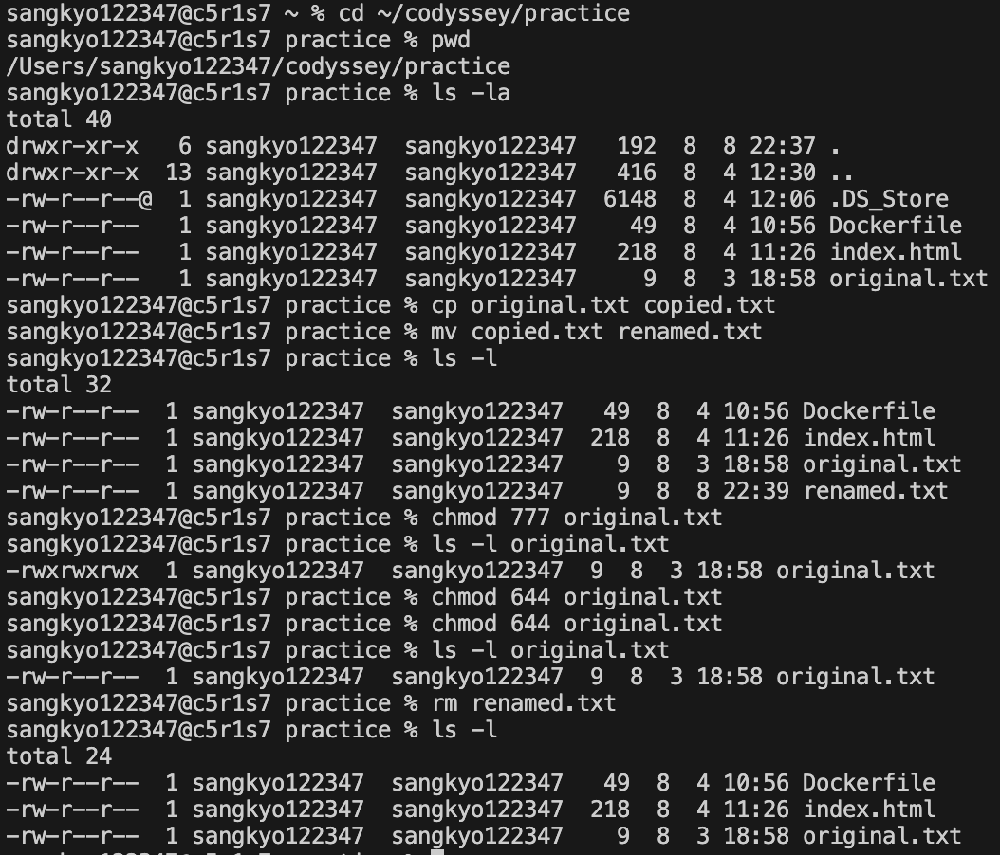

---

## 6. 파일과 디렉터리 권한 실습

리눅스·유닉스 권한은 `r`, `w`, `x`로 표시됩니다.

| 기호 | 의미 |
|---|---|
| `r` | 읽기 |
| `w` | 쓰기 |
| `x` | 실행 또는 디렉터리 접근 |

숫자 권한은 다음 값을 더해 표현합니다.

| 권한 | 숫자 |
|---|---|
| 읽기 | 4 |
| 쓰기 | 2 |
| 실행 | 1 |

예를 들어 `7`은 `4 + 2 + 1`이므로 읽기·쓰기·실행이 모두 가능하다는 뜻입니다.

### 6-1. 파일 권한 변경

```bash
ls -l practice/permission.txt
chmod 777 practice/permission.txt
ls -l practice/permission.txt
chmod 644 practice/permission.txt
ls -l practice/permission.txt
```

| 권한 | 의미 | 사용 기준 |
|---|---|---|
| `777` | 소유자·그룹·기타 사용자 모두 읽기·쓰기·실행 가능 | 실습 외에는 권장하지 않음 |
| `644` | 소유자는 읽기·쓰기, 나머지는 읽기만 가능 | 일반 웹 문서나 설정 파일에 적합 |
| `755` | 소유자는 읽기·쓰기·실행, 나머지는 읽기·실행 가능 | 실행이 필요한 스크립트나 디렉터리에 사용 가능 |

보안 관점에서는 모든 사용자에게 쓰기 권한을 주는 `777`은 위험할 수 있습니다. 일반적인 웹 문서 파일은 `644`, 실행 스크립트는 필요한 경우 `755`를 사용하는 것이 더 안전합니다.

증거:

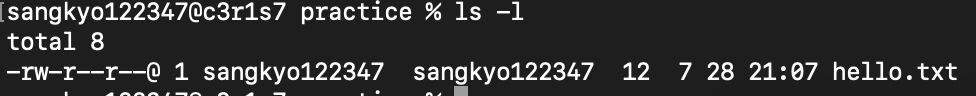

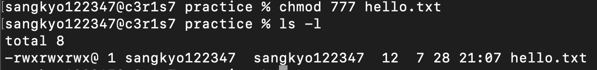

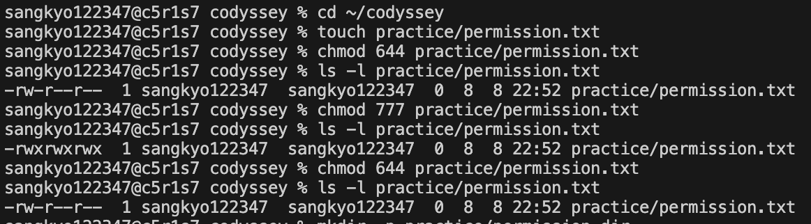

### 6-2. 디렉터리 권한 변경

```bash
mkdir -p practice/permission-dir
ls -ld practice/permission-dir
chmod 700 practice/permission-dir
ls -ld practice/permission-dir
chmod 755 practice/permission-dir
ls -ld practice/permission-dir
```

| 권한 | 의미 |
|---|---|
| `700` | 소유자만 읽기·쓰기·접근 가능 |
| `755` | 소유자는 읽기·쓰기·접근, 나머지는 읽기·접근 가능 |

디렉터리에서 `x` 권한은 파일 실행이 아니라 해당 디렉터리 안으로 들어가거나 내부 항목에 접근할 수 있는 권한입니다.

증거:

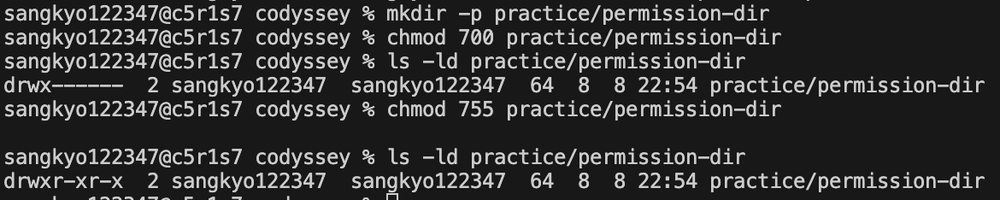

---

## 7. Docker 설치 및 기본 점검

OrbStack을 실행하면 내부 Docker 엔진이 함께 실행됩니다.

```bash
docker --version
docker info
docker images
docker ps
docker ps -a
```

| 명령어 | 의미 |
|---|---|
| `docker --version` | Docker 명령어 설치 및 버전 확인 |
| `docker info` | Docker 엔진 동작 상태 확인 |
| `docker images` | 내려받거나 직접 만든 이미지 목록 확인 |
| `docker ps` | 실행 중인 컨테이너 확인 |
| `docker ps -a` | 종료된 컨테이너를 포함한 전체 목록 확인 |

`docker --version`은 Docker 명령어가 설치되어 있는지 확인하는 명령입니다. 반면 `docker info`와 `docker ps`는 Docker 엔진이 실제로 실행 중인지 확인하는 명령입니다.

OrbStack이 켜져 있고 Docker 엔진이 정상 작동하면 `docker ps` 실행 시 컨테이너가 없더라도 다음과 같은 제목줄이 출력됩니다.

```text
CONTAINER ID   IMAGE   COMMAND   CREATED   STATUS   PORTS   NAMES
```

증거:

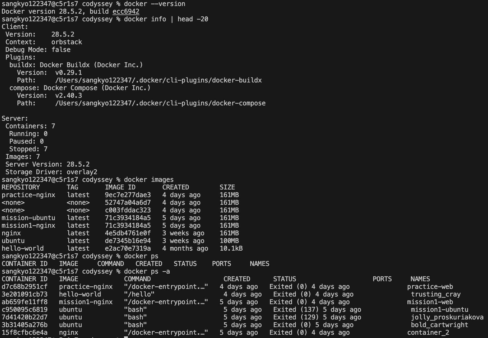

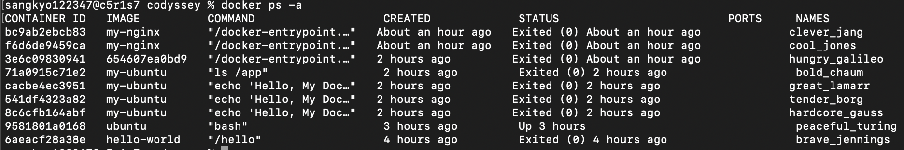

---

## 8. Docker 컨테이너 실습

### 8-1. `hello-world` 실행

```bash
docker run hello-world
```

정상 실행 시 다음 문구를 확인했습니다.

```text
Hello from Docker!
This message shows that your installation appears to be working correctly.
```

`hello-world`는 Docker가 이미지를 내려받고 컨테이너를 생성한 뒤 정상 메시지를 출력할 수 있는지 확인하는 가장 기본적인 점검용 이미지입니다. 메시지를 출력한 뒤 할 일이 끝나므로 컨테이너가 종료되는 것이 정상입니다.

실행 화면 증거:

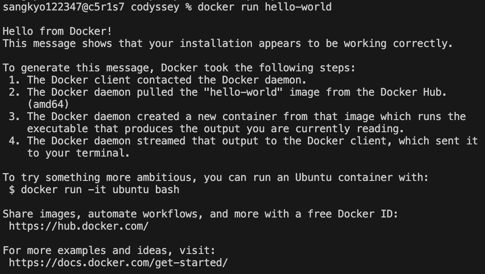

### 8-2. Ubuntu 컨테이너 실행

```bash
docker run -it ubuntu bash
pwd
ls
cat /etc/os-release
mkdir -p /home/mytest
echo "Hello Docker" > /home/mytest/test.txt
cat /home/mytest/test.txt
exit
```

Ubuntu 컨테이너 안에서는 macOS가 아니라 Linux 환경의 명령을 실행합니다. `cat /etc/os-release`로 컨테이너 내부 운영체제 정보를 확인했습니다.

증거:

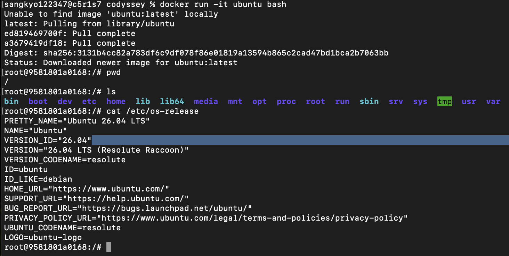

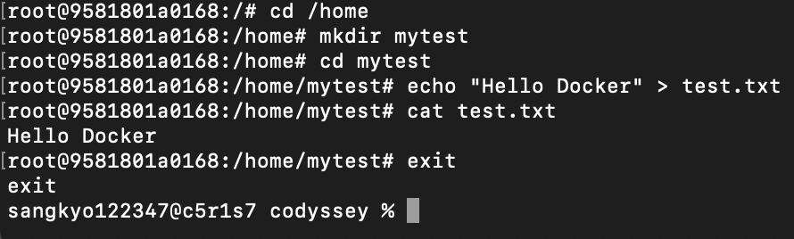

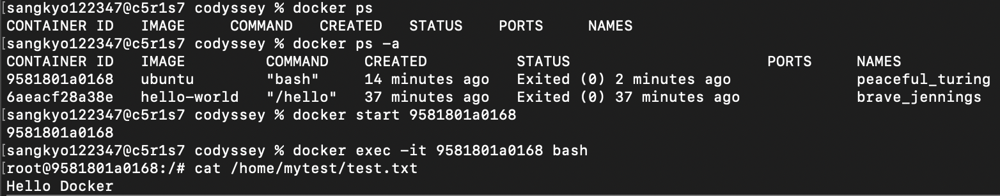

### 8-3. `attach` 방식과 `exec` 방식에서 관찰한 차이

```bash
docker run -it ubuntu bash
```

이 방식은 컨테이너의 주 프로세스에 터미널이 직접 연결됩니다. 컨테이너 안에서 `exit`하면 주 프로세스가 끝나면서 컨테이너도 종료됩니다.

```bash
docker start peaceful_turing
docker exec -it peaceful_turing bash
```

`exec`는 이미 실행 중인 컨테이너 안에 새로운 셸을 추가로 실행합니다. `exec`로 들어간 셸에서 나와도 컨테이너의 주 프로세스가 계속 실행 중이라면 컨테이너는 유지됩니다.

차이 정리:

| 방식 | 의미 | 주의점 |
|---|---|---|
| `attach` | 컨테이너의 원래 실행 화면에 붙음 | `exit`나 `Control + C`로 컨테이너가 종료될 수 있음 |
| `exec` | 실행 중인 컨테이너 안에 새 명령이나 셸을 실행 | `exit`해도 원래 컨테이너는 계속 실행될 수 있음 |

### 8-4. 로그와 자원 사용량 확인

```bash
docker logs clever_jang
docker start clever_jang
docker stats --no-stream clever_jang
```

| 명령어 | 의미 |
|---|---|
| `docker logs` | 컨테이너 실행 기록 확인 |
| `docker stats --no-stream` | CPU와 메모리 사용량을 한 번만 측정 |

Nginx 접속 로그에서 `GET / HTTP/1.1" 200`이 보이면 브라우저 요청이 정상 처리된 것입니다. `favicon.ico`에 대한 `404`는 브라우저 탭 아이콘 파일이 없어서 발생할 수 있으며, 웹페이지 본문 표시에는 문제가 없습니다.

증거:

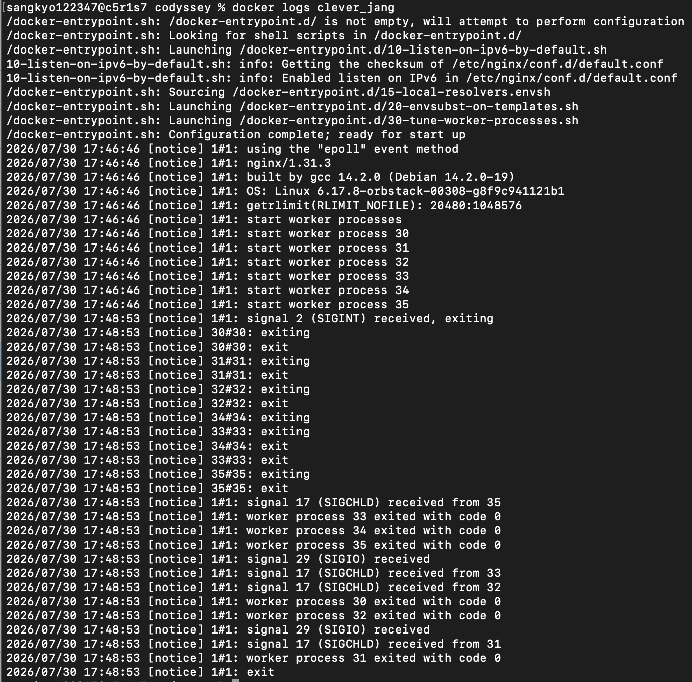

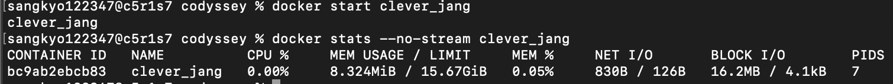

---

## 9. Dockerfile 기반 Nginx 웹 서버

### 9-1. 사용한 베이스 이미지

Nginx 공식 이미지를 베이스로 사용했습니다.

```dockerfile
FROM nginx
COPY index.html /usr/share/nginx/html/
```

| 줄 | 의미 |
|---|---|
| `FROM nginx` | Nginx가 준비된 기본 이미지를 사용 |
| `COPY index.html /usr/share/nginx/html/` | 현재 폴더의 `index.html`을 Nginx 웹 문서 폴더로 복사 |

커스텀한 부분은 기본 Nginx 페이지 대신 직접 만든 `index.html`을 복사한 것입니다.

### 9-2. 웹페이지 소스

```html
<!DOCTYPE html>
<html>
<head>
    <meta charset="UTF-8">
    <title>Bind Mount Test</title>
</head>
<body>
    <h1>Bind Mount Success!</h1>
    <p>맥에서 수정한 내용이 컨테이너에 바로 반영되었습니다.</p>
</body>
</html>
```

`<meta charset="UTF-8">`는 브라우저가 한글을 올바르게 읽도록 하는 문자 인코딩 설정입니다.

### 9-3. 이미지 빌드

```bash
docker build -t my-nginx .
```

| 부분 | 의미 |
|---|---|
| `docker build` | Dockerfile을 읽어 이미지 제작 |
| `-t my-nginx` | 이미지 이름을 `my-nginx`로 지정 |
| `.` | 현재 폴더를 빌드 재료로 사용 |

빌드 성공 시 `naming to docker.io/library/my-nginx` 또는 이미지 ID가 출력됩니다.

증거:

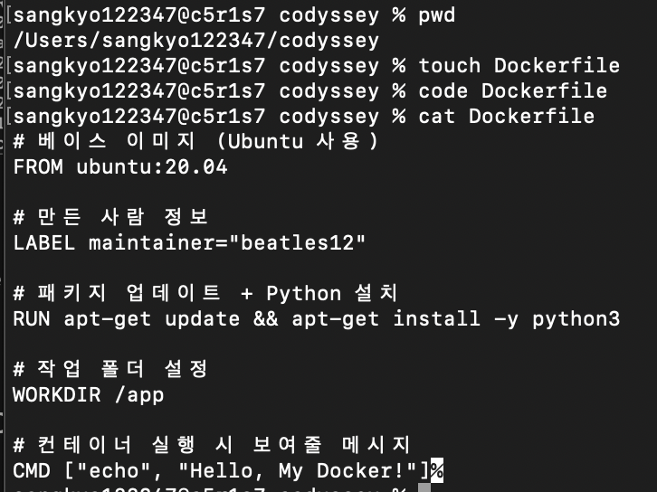

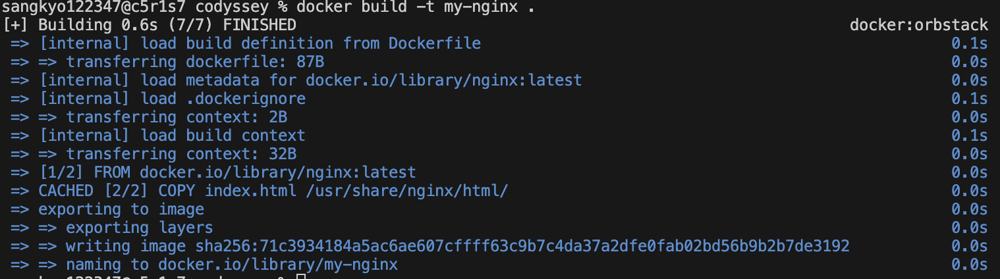

### 9-4. 포트 매핑 실행

```bash
docker run -p 8080:80 my-nginx
```

- 맥의 `8080` 포트와 컨테이너의 `80` 포트를 연결했습니다.
- 브라우저에서 `http://localhost:8080`으로 접속했습니다.

포트 매핑은 컨테이너 안에서만 열려 있는 웹 서버를 맥의 브라우저에서 볼 수 있게 연결하는 역할을 합니다.

```text
브라우저
→ 맥의 8080 포트
→ 컨테이너의 80 포트
→ 컨테이너 안의 Nginx
→ index.html 전달
```

증거:

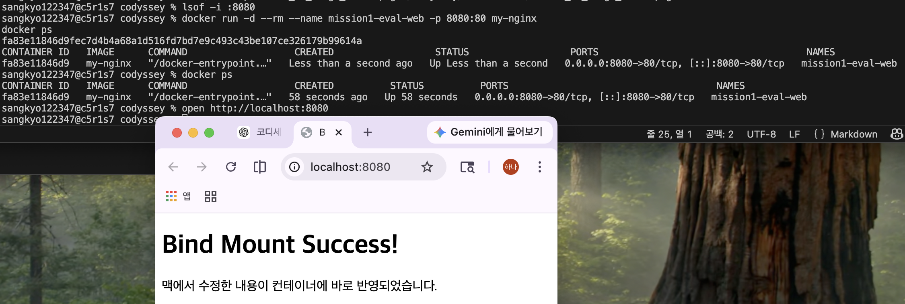

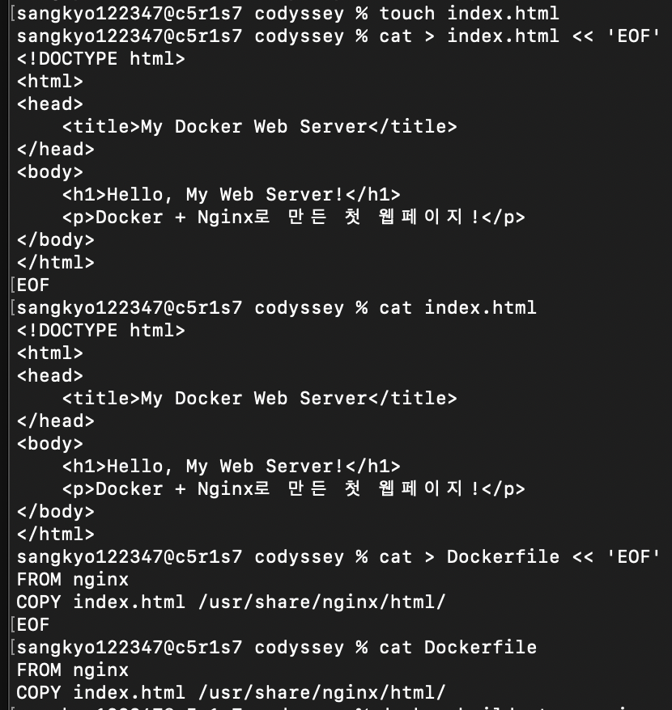

### 9-5. Docker 이미지와 컨테이너의 차이

Docker 이미지는 컨테이너를 만들기 위한 실행 설계도입니다. 이미지 자체는 실행 중에 직접 변경되는 것이 아니라, 같은 이미지로 여러 컨테이너를 만들 수 있습니다.

컨테이너는 이미지를 실제로 실행한 상태입니다. 컨테이너 안에서는 파일을 만들거나 수정할 수 있지만, 컨테이너를 삭제하면 컨테이너 내부의 변경 내용은 사라질 수 있습니다.

예를 들어:

| 구분 | 예시 | 의미 |
|---|---|---|
| 이미지 | `my-nginx`, `practice-nginx` | Nginx 웹 서버를 만들기 위한 실행 설계도 |
| 컨테이너 | `mission1-web`, `practice-web` | 이미지를 실제로 실행한 독립 실행 공간 |

전체 흐름은 다음과 같습니다.

```text
Dockerfile 작성
→ docker build
→ 이미지 생성
→ docker run
→ 컨테이너 실행
→ 브라우저에서 확인
```

쉽게 비유하면:

```text
Dockerfile = 조리법
Docker 이미지 = 조리된 냉동식품 또는 붕어빵 틀
컨테이너 = 실제로 데워 실행 중인 음식 또는 틀로 찍어낸 붕어빵
```

중요한 점은 Dockerfile이나 `index.html`을 수정해도 이미 실행 중인 컨테이너가 자동으로 바뀌지는 않는다는 것입니다. `COPY` 방식으로 만든 웹페이지를 수정하려면 일반적으로 이미지를 다시 빌드하고 새 컨테이너를 실행해야 합니다.

---

## 10. 네임스페이스와 포트 노출

Docker 컨테이너는 프로세스, 파일 시스템, 네트워크 등을 서로 분리하여 실행합니다. 이처럼 컨테이너별로 독립된 실행 공간을 만드는 데 Linux 네임스페이스가 사용됩니다.

특히 **네트워크 네임스페이스** 때문에 컨테이너는 호스트 Mac과 별도의 네트워크 공간을 가집니다. 따라서 컨테이너 안의 Nginx가 `80`번 포트에서 정상 실행 중이어도, 그 `80`번 포트는 기본적으로 **컨테이너 내부의 포트**입니다.

즉 Mac 브라우저가 `localhost:80`에 접속한다고 해서 컨테이너의 `80`번 포트로 자동 연결되는 것은 아닙니다. 호스트 포트와 컨테이너 포트를 연결하는 **포트 매핑**이 필요한 이유가 이것입니다.

```bash
docker run -p 8080:80 my-nginx
```

`-p 8080:80`은 다음 의미입니다.

```text
호스트 Mac의 8080번 포트
↓
Docker가 연결
↓
컨테이너의 80번 포트(Nginx)
```

실습에서는 브라우저에서 `http://localhost:8080`으로 접속하여 이 연결을 확인했습니다.

포트를 외부에 연결하면 브라우저 등에서 컨테이너 서비스에 접근할 수 있습니다. 다만 보안 관점에서는 다음 사항을 주의해야 합니다.

- 필요한 포트만 공개합니다.
- 사용하지 않는 컨테이너는 계속 실행 상태로 방치하지 않습니다.
- 민감한 서비스는 외부 공개 여부를 반드시 확인합니다.
- 운영 환경에서는 방화벽과 접근 권한을 함께 고려합니다.
- 실습용 포트라도 충돌이나 노출 범위를 확인하는 습관이 필요합니다.

정리하면 포트 매핑은 컨테이너 내부 서비스를 밖에서 볼 수 있게 문을 여는 작업이며, 문을 열 때는 필요한 문만 열어야 합니다.

---

## 11. 바인드 마운트 변경 반영

바인드 마운트는 맥의 파일과 컨테이너 안의 파일을 직접 연결하는 방식입니다.

### 11-1. 실행 명령

```bash
docker run -d \
  --name codyssey-bind \
  -p 8081:80 \
  -v "$(pwd)/index.html:/usr/share/nginx/html/index.html:ro" \
  my-nginx
```

| 옵션 | 의미 |
|---|---|
| `-d` | 백그라운드 실행 |
| `--name codyssey-bind` | 컨테이너 이름 지정 |
| `-p 8081:80` | 맥 8081 포트와 컨테이너 80 포트 연결 |
| `-v` | 맥의 파일과 컨테이너의 파일 위치 연결 |
| `:ro` | 컨테이너에서 해당 파일을 읽기 전용으로 사용 |

### 11-2. 변경 전·후 확인

1. 브라우저에서 `http://localhost:8081` 접속
2. 변경 전 화면 캡처
3. 맥의 `index.html` 내용 수정
4. 파일 저장
5. 브라우저에서 `Command + Shift + R`로 강력 새로고침
6. 바뀐 문구가 즉시 표시되는지 확인

증거:

**변경 전**

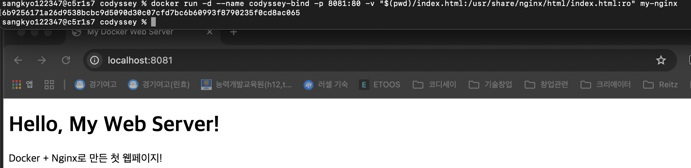

**변경 후**

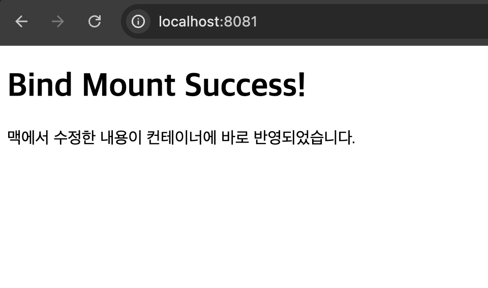

결과: Docker 이미지를 다시 빌드하거나 컨테이너를 다시 만들지 않아도, 맥의 파일 변경이 컨테이너 웹페이지에 바로 반영됐습니다.

### 11-3. 절대 경로와 상대 경로 선택 기준

바인드 마운트 명령에서 `:` 왼쪽은 맥의 파일 경로이고, 오른쪽은 컨테이너 내부의 경로입니다.

```bash
docker run -v "$(pwd)/index.html:/usr/share/nginx/html/index.html:ro" nginx
```

`$(pwd)`는 현재 작업 폴더를 절대 경로로 바꿔 줍니다.

예를 들어 현재 폴더가 다음이라면:

```text
/Users/사용자이름/codyssey
```

`$(pwd)/index.html`은 실제로 다음과 같은 경로가 됩니다.

```text
/Users/사용자이름/codyssey/index.html
```

상황별 선택 기준은 다음과 같습니다.

| 상황 | 권장 방식 | 이유 |
|---|---|---|
| 개인 컴퓨터에서 직접 실행 | 절대 경로 또는 `$(pwd)` | 현재 위치를 명확히 지정하여 경로 오류를 줄임 |
| 다른 컴퓨터에서도 재현해야 하는 프로젝트 | 프로젝트 폴더 기준 경로 | 사용자 이름이 달라도 재현 가능 |
| 셸 스크립트·CI 환경 | 현재 작업 디렉터리나 환경변수 사용 | 고정된 개인 경로를 피함 |
| 컨테이너 내부 경로 | `/usr/share/nginx/html`처럼 절대 경로 | 컨테이너 안의 표준 위치를 명확히 지정 |

맥의 경로와 컨테이너 내부 경로는 서로 다른 세계의 주소입니다. 따라서 왼쪽은 내 컴퓨터 기준, 오른쪽은 컨테이너 기준으로 구분해야 합니다.

---

## 12. Docker 볼륨 영속성 검증

Docker 볼륨은 컨테이너와 분리되어 데이터를 보관합니다. 따라서 컨테이너를 삭제해도 볼륨을 삭제하지 않으면 데이터가 유지됩니다.

### 12-1. 볼륨 생성

```bash
docker volume create codyssey-data
docker volume ls
```

### 12-2. 첫 번째 컨테이너에서 파일 생성

```bash
docker run -d \
  --name volume-test-1 \
  -v codyssey-data:/data \
  ubuntu sleep infinity
```

```bash
docker exec volume-test-1 bash -lc \
  'echo "Docker volume data" > /data/message.txt && cat /data/message.txt'
```

출력:

```text
Docker volume data
```

### 12-3. 첫 번째 컨테이너 삭제

```bash
docker stop volume-test-1
docker rm volume-test-1
```

이 명령은 시험용 컨테이너만 삭제하고 `codyssey-data` 볼륨은 삭제하지 않습니다.

### 12-4. 두 번째 컨테이너에서 데이터 확인

```bash
docker run \
  --name volume-test-2 \
  -v codyssey-data:/data \
  ubuntu cat /data/message.txt
```

출력:

```text
Docker volume data
```

결과: 첫 번째 컨테이너를 삭제한 뒤 새 컨테이너를 만들어도 볼륨 속 파일이 그대로 유지됐습니다.

증거:

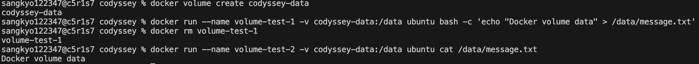

### 12-5. 컨테이너 삭제로 인한 데이터 손실을 막는 방법

컨테이너의 일반 파일 시스템에만 데이터를 저장하면 컨테이너를 삭제할 때 그 변경 내용이 함께 사라질 수 있습니다.

이를 방지하는 대표적인 방법은 세 가지입니다.

| 방법 | 특징 | 적합한 상황 |
|---|---|---|
| Docker 볼륨 | Docker가 별도 영역에 데이터를 관리 | DB 데이터, 지속적으로 보존할 데이터 |
| 바인드 마운트 | Mac의 실제 파일·폴더를 컨테이너와 직접 연결 | 소스코드, 개발 중 즉시 반영할 파일 |
| 별도 백업 | 볼륨이나 중요 데이터를 외부 파일로 복사 | 컴퓨터 초기화·장애까지 대비 |

이번 실습에서는 `codyssey-data`라는 **named volume**을 사용하여 첫 번째 컨테이너를 삭제한 뒤에도 두 번째 컨테이너에서 `message.txt`가 그대로 읽히는 것을 확인했습니다.

즉 실습에서 확인한 핵심은 다음과 같습니다.

```text
컨테이너 내부에만 저장 → 컨테이너 삭제 시 손실 가능
Docker 볼륨 사용      → 컨테이너가 바뀌어도 데이터 유지
별도 백업             → 컴퓨터·Docker 환경 자체 문제까지 대비
```

### 12-6. Docker 볼륨 백업 개념

Docker 볼륨은 컨테이너와 별도로 저장되므로 컨테이너를 삭제해도 데이터가 유지됩니다. 그러나 다음 상황에서는 별도 백업이 필요합니다.

- 컴퓨터 초기화
- Docker 환경 삭제
- 디스크 장애
- 실수로 볼륨 자체를 삭제한 경우

예를 들어 `codyssey-data` 볼륨을 현재 폴더에 압축 파일로 백업할 수 있습니다.

```bash
docker run --rm \
  -v codyssey-data:/data \
  -v "$(pwd):/backup" \
  alpine \
  tar czf /backup/codyssey-data-backup.tar.gz -C /data .
```

이 명령은 볼륨 안의 데이터를 `codyssey-data-backup.tar.gz` 파일로 저장하는 예시입니다. 중요한 백업 파일은 필요에 따라 외장 저장장치나 별도의 안전한 저장 공간에 보관합니다.

정리하면:

```text
Docker 볼륨 = 컨테이너 삭제에 대비한 데이터 보존
백업 = 컴퓨터 초기화나 장애까지 대비하는 별도의 복사본
```

특히 실습용 Mac이 주기적으로 초기화되는 환경에서는 GitHub에 코드와 문서를 저장하고, Docker 볼륨 데이터가 중요하다면 별도 백업을 함께 고려해야 합니다.

---

## 13. 포트 충돌 진단 및 해결

Docker 컨테이너 실행 시 다음과 같은 포트 충돌 오류가 발생할 수 있습니다.

```text
port is already allocated
```

예를 들어 8080번 포트를 확인하려면 다음 명령을 사용합니다.

```bash
lsof -i :8080
```

출력이 있으면 8080번 포트를 다른 프로세스가 사용 중이라는 뜻입니다.

문제 해결 순서는 다음과 같습니다.

```text
포트 오류 확인
→ lsof로 포트 사용 여부 확인
→ 어떤 프로세스가 사용 중인지 확인
→ 기존 프로그램을 종료할지 판단
→ 필요하면 다른 포트로 변경
```

기존 프로그램을 함부로 종료하지 않고 새로운 포트를 사용할 수도 있습니다.

```bash
docker run -p 8082:80 my-nginx
```

이 경우 브라우저에서는 다음 주소로 접속합니다.

```text
http://localhost:8082
```

진단 화면 증거:


---

## 14. Git 및 GitHub 연동

### 14-1. Git 사용자 및 기본 브랜치 설정

```bash
git config --global user.name "<사용자 이름>"
git config --global user.email "<GitHub 이메일>"
git config --global init.defaultBranch main
git config --global init.defaultBranch
```

출력:

```text
main
```

개인 이메일은 공개 문서와 스크린샷에서 노출되지 않도록 주의했습니다.

### 14-2. GitHub SSH 연결

```bash
ssh-keygen -t ed25519 -C "<GitHub 이메일>"
ssh -T git@github.com
```

SSH 연결 성공 후 비밀번호를 매번 입력하지 않고 GitHub 저장소와 통신할 수 있었습니다.

성공 예시:

```text
Hi beatles12! You've successfully authenticated, but GitHub does not provide shell access.
```

### 14-3. 원격 저장소 주소 확인

```bash
git remote -v
```

SSH 방식이면 다음과 비슷하게 표시됩니다.

```text
origin  git@github.com:beatles12/codyssey.git (fetch)
origin  git@github.com:beatles12/codyssey.git (push)
```

실행 화면 증거:


HTTPS 방식으로 복제한 경우 `git push` 때 사용자 이름과 인증을 다시 요구할 수 있으므로, SSH 설정 후에는 원격 주소를 확인하는 것이 좋습니다.

### 14-4. GitHub 최신 내용 가져오기와 푸시

```bash
git fetch origin
git pull --rebase origin main
git push origin main
git status
```

| 명령어 | 의미 |
|---|---|
| `fetch` | GitHub에 새 기록이 있는지 확인 |
| `pull --rebase` | GitHub 최신 기록을 먼저 놓고 내 커밋을 그 위에 정리 |
| `push` | 내 로컬 커밋을 GitHub로 업로드 |
| `status` | 로컬과 GitHub의 동기화 상태 확인 |

최종 확인 결과:

```text
현재 브랜치 main
브랜치가 'origin/main'에 맞게 업데이트된 상태입니다.

커밋할 사항 없음, 작업 폴더 깨끗함
```

증거:

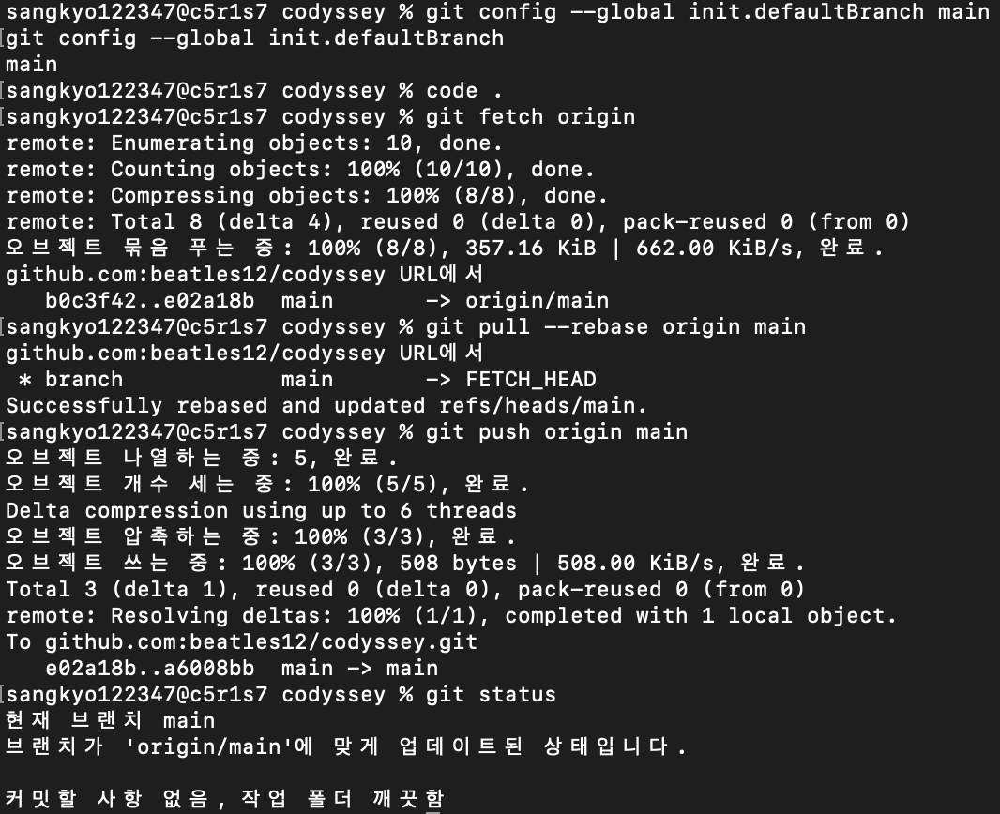

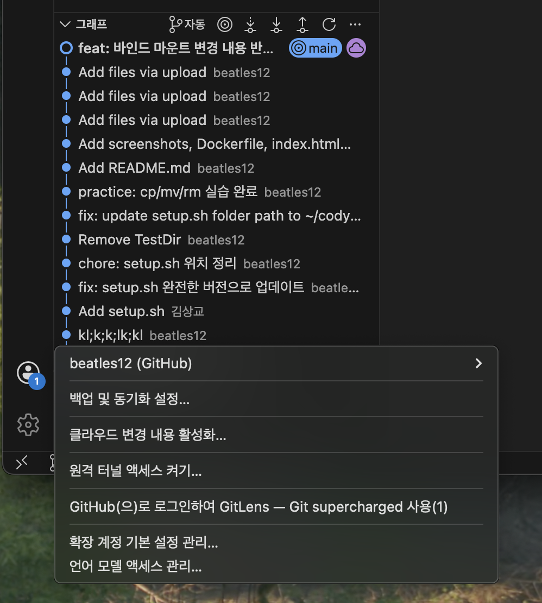


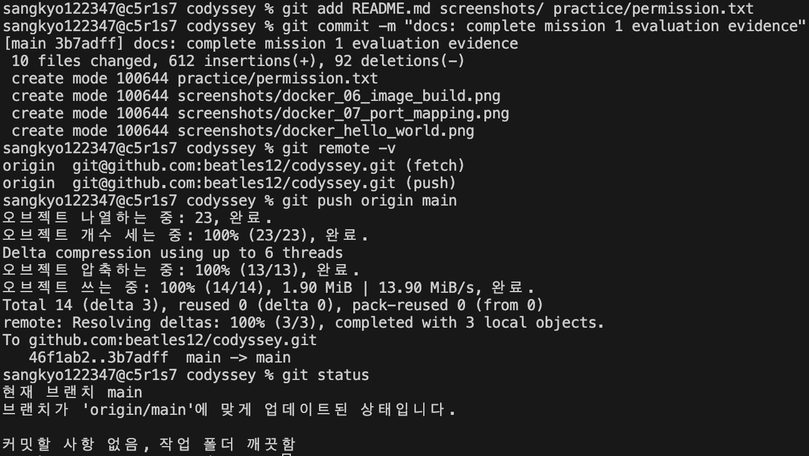

---

## 15. 트러블슈팅

### 문제 1. 한글이 깨져 보임

**문제**  
Nginx 웹페이지에서 한글이 정상적으로 표시되지 않았습니다.

**원인 가설**  
브라우저가 HTML 파일의 문자 인코딩을 정확히 알지 못한 것으로 판단했습니다.

**확인**  
`index.html`의 `<head>` 안에 문자 인코딩 설정이 없는지 확인했습니다.

**해결**

```html
<meta charset="UTF-8">
```

를 추가한 뒤 이미지를 다시 빌드하고 컨테이너를 실행했습니다. 이후 한글이 정상적으로 표시됐습니다.

### 문제 2. Docker 데몬에 연결할 수 없음

**문제**

```text
Cannot connect to the Docker daemon...
Is the docker daemon running?
```

오류가 발생했습니다.

**원인 가설**  
OrbStack 앱은 열려 있었지만 Docker 엔진이 `Starting` 상태에서 멈춰 있었습니다.

**확인**  
OrbStack 화면에서 컨테이너 목록이 나타나지 않고 `Starting`만 계속 표시되는 것을 확인했습니다.

**해결**  
OrbStack을 완전히 종료한 뒤 다시 실행했으나 해결되지 않아 macOS를 재시동했습니다. 재시동 후 OrbStack을 실행하자 컨테이너 목록이 정상적으로 나타났고 Docker 명령도 다시 동작했습니다.

### 문제 3. HTML을 수정했지만 브라우저에 예전 내용이 보임

**문제**  
`index.html`을 수정하고 저장했지만 브라우저에는 이전 문구가 계속 표시됐습니다.

**원인 가설**  
브라우저 캐시에 이전 페이지가 남아 있는 것으로 판단했습니다.

**확인**

```bash
cat index.html
```

로 파일 내용을 확인했으며, 터미널에서는 수정된 문구가 정상적으로 보였습니다.

**해결**  
브라우저에서 `Command + Shift + R`을 눌러 캐시를 무시하고 강력 새로고침했습니다. 수정한 내용이 바로 표시됐습니다.

### 문제 4. 포트가 이미 사용 중임

**문제**

```text
port is already allocated
```

와 같은 오류가 발생할 수 있습니다.

**확인**

```bash
lsof -i :8080
```

로 8080번 포트를 사용 중인 프로세스가 있는지 확인합니다.

**해결**

기존 프로그램을 무리하게 종료하기보다 필요하면 다른 포트를 사용합니다.

```bash
docker run -p 8082:80 my-nginx
```

### 가장 어려웠던 문제: Docker 데몬 연결 실패

미션 수행 중 가장 어려웠던 지점은 OrbStack 앱은 열려 있는데 Docker 명령이 동작하지 않았던 상황이었습니다.

**1. 가설**  
Docker 명령 자체의 문제가 아니라 OrbStack 내부 Docker 엔진이 정상적으로 시작되지 않은 것으로 추정했습니다.

**2. 확인**  

터미널에서 다음과 같은 메시지를 확인했습니다.

```text
Cannot connect to the Docker daemon...
Is the docker daemon running?
```

또한 OrbStack 화면에서 Docker가 `Starting` 상태에 머물러 있는 것을 확인했습니다.

**3. 조치**  

먼저 OrbStack을 완전히 종료한 뒤 다시 실행했습니다. 그래도 정상화되지 않아 macOS를 재시동하고 OrbStack을 다시 실행했습니다.

**4. 결과 확인**  

재시동 후 다음 명령이 정상적으로 실행되는지 확인했습니다.

```bash
docker info
docker ps
```

`docker ps`에서 다음과 같은 제목줄이 출력되어 Docker 엔진이 정상 작동하는 것을 확인했습니다.

```text
CONTAINER ID   IMAGE   COMMAND   CREATED   STATUS   PORTS   NAMES
```

이 경험을 통해 문제를 바로 지우거나 다시 설치하기보다 **가설 → 확인 → 조치 → 결과 확인** 순서로 좁혀 가는 것이 중요하다는 점을 배웠습니다.

---

## 16. 보안 및 개인정보 보호

- GitHub 비밀번호, 토큰, 인증 코드, 개인키는 저장소에 올리지 않았습니다.
- SSH 개인키 파일은 절대 GitHub에 업로드하지 않습니다.
- Git 이메일이 보이는 스크린샷은 공개 전에 가리거나 제외합니다.
- 공개키는 인증에 사용될 수 있지만 개인키와는 다릅니다.
- 저장소에 민감정보가 포함되지 않았는지 제출 전에 다시 확인합니다.
- Docker 포트를 외부에 공개할 때는 꼭 필요한 포트만 노출합니다.
- 운영 환경에서는 방화벽과 접근 권한도 함께 확인해야 합니다.

---

## 17. 주요 검증 순서

평가자는 다음 순서로 결과를 확인할 수 있습니다.

1. `README.md`에서 전체 수행 내용 확인
2. `Dockerfile`과 `index.html` 확인
3. `screenshots/`에서 터미널·권한·Docker·Git 증거 확인
4. `bind_before.png`와 `bind_after.png` 비교
5. `docker_volume_persistence.png`에서 컨테이너 삭제 전·후 데이터 유지 확인
6. `git_sync_and_status_clean.png`에서 GitHub 동기화 상태 확인
7. `vscode_github_login.png`에서 VSCode GitHub 로그인과 `main` 브랜치 확인

재현 순서는 다음과 같습니다.

```text
Docker 실행 상태 확인
→ Dockerfile과 index.html 확인
→ docker build
→ docker run
→ 브라우저 접속
→ 바인드 마운트 검증
→ Docker 볼륨 검증
→ Git 상태 확인
```

---

## 18. 발표 시연 순서

발표에서는 다음 순서로 보여주면 됩니다.

1. GitHub 저장소와 README 구조 확인
2. `docker --version`, `docker ps`로 Docker 동작 확인
3. `Dockerfile` 설명: `FROM nginx`, `COPY index.html ...`
4. `docker build -t my-nginx .`로 이미지 생성 설명
5. `docker run -p 8080:80 my-nginx`로 컨테이너 실행 설명
6. 브라우저에서 `localhost:8080` 접속 화면 확인
7. 바인드 마운트는 맥 파일과 컨테이너 파일을 연결하는 방식이라고 설명
8. Docker 볼륨은 컨테이너 삭제 후에도 데이터를 유지하는 저장 공간이라고 설명
9. 이미지와 컨테이너 차이, 포트 보안, 백업 개념을 보완 설명
10. `git status`로 GitHub 제출 상태 확인

발표 핵심 문장:

```text
이번 미션에서는 개발 환경을 만들고, Docker로 웹 서버를 실행하고,
그 과정을 GitHub에 증거와 함께 정리했습니다.
```

---

## 19. GitHub 저장소

`https://github.com/beatles12/codyssey`

---

## Docker 주요 명령어 복습

| 명령어 | 쉬운 해석 |
|---|---|
| `docker --version` | 설치된 Docker 버전을 확인한다. |
| `docker run hello-world` | 미리 만들어진 `hello-world` 이미지로 컨테이너를 만들어 실행한다. Docker 정상 작동 확인용이다. |
| `docker build -t my-nginx .` | 현재 폴더(`.`)의 Dockerfile로 이미지를 만들고 `-t`로 `my-nginx`라는 이름표(tag)를 붙인다. |
| `docker images` | 내 컴퓨터에 저장된 Docker 이미지 목록을 본다. |
| `docker ps` | 현재 실행 중인 컨테이너를 본다. |
| `docker ps -a` | 실행 중이거나 종료된 모든 컨테이너를 본다. |
| `docker run -d` | 컨테이너를 터미널 뒤쪽(background)에서 실행한다. |
| `docker run -it ubuntu bash` | Ubuntu 컨테이너를 실행하고 내가 직접 터미널 명령을 입력할 수 있게 접속한다. `-i`는 입력 연결, `-t`는 터미널 연결이다. |
| `-p 8080:80` | 내 Mac의 8080번 포트와 컨테이너의 80번 포트를 연결한다. |
| `-v codyssey-data:/data` | Docker 볼륨 `codyssey-data`를 컨테이너 안 `/data` 폴더에 연결한다. |
| `docker rm 이름` | 종료된 컨테이너를 삭제한다. |
| `docker volume ls` | Docker 볼륨 목록을 확인한다. |

### 기억하기

- **이미지(Image)** = 컨테이너를 만들기 위한 틀
- **컨테이너(Container)** = 이미지를 이용해 실제 실행한 것
- **Dockerfile** = 어떤 이미지를 만들지 적어 둔 제작 설명서
- **Volume** = 컨테이너가 없어져도 데이터를 남겨 두는 별도 저장공간
- **Port Mapping** = Mac의 문과 컨테이너의 문을 연결하는 것

